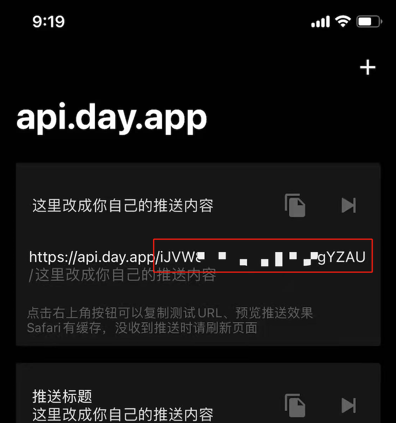
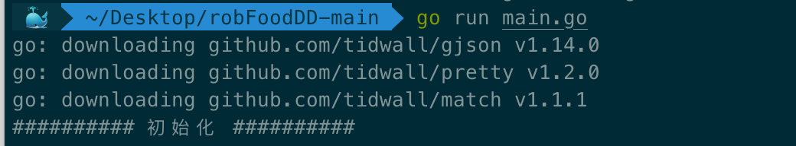

## 项目背景

随着奥密克戎在上海的进一步爆发，导致如今上海以黄浦江为界一分为二：浦东和浦西。

相比之浦西来讲，浦东的疫情更为严峻，因此对于即将或已经面临生存困境的人来讲，通过学习此脚本或许可以为你在困境之中争得一丝生存之机。


## 环境配置

运行本脚本之前，你需要安装 Golang 运行环境，你可以通过以下快捷方式安装，或访问 [Golang 官网](https://go.dev/doc/install)自行下载安装包手动安装。

- macOS
	- 打开终端，通过 [Brew](https://brew.sh) 安装： ```brew install go```
- Windows
	- 下载安装包：[https://go.dev/doc/install](https://go.dev/doc/install)


安装结束后，在终端输入 `go version` 来验证是否安装成功。


## 脚本说明

### 获取 Token

在使用本脚本之前，你需要获取叮咚的登录 Token (形如：`DDXQSESSID=xxxxxx`)，你可以通过以下任意一种方式来获取：

- 通过在电脑上安装 Charles，并配置抓包代理，在移动端获取此 Token；
- 通过在手机上安装 抓包软件来获取 Token，[参考这里](https://github.com/hzz765/robFoodDD/issues/35)(未亲测)；
- 通过 web 网页端获取登录 Token，[参考这里](https://github.com/hzz765/robFoodDD/issues/43)(未亲测)。

### 脚本配置

下载本项目文件，打开 `main.go` 文件，将上面获取的 `DDXQSESSID=xxx` 的 Token 替换到文件中大约第 12 行左右的位置：

 ```go
 err := session.InitSession("DDXQSESSID=xxxxxxxxxxx", "xxxxxxxxxxxxx")
 ```

参数说明：

- 将第一个 `DDXQSESSID=xxxxxxxxxxx` 替换为你的 Token；
- 第二个 `xxxxxxxxxxxxx` 为 Bark app 需要的推送 Token(非必要，但推荐用于在你手机上接收下单成功的推送提醒)。
	- 此 Token 需要你在 AppStore 搜索 Bark app 并下载，然后在 App 拷贝 Token 替换到此 main.go 文件，参考下图：
		- 


## 如何使用

一切配置就绪之后，打开终端，进入项目根目录。

执行：`go run main.go` 命令运行脚本，如下图示：



之后根据提示，选择你的地址、商品结算模式、支付方式，然后耐心等待即可。


## 注意事项

- **除非你真的面临温饱困境，否则不建议你频繁使用此脚本，请在保证自身无忧的情况下尽可能将机会留给更需要的人**；
- 本脚本侧重于捡漏行为，通过 main.go 文件里的 Sleep 函数来随机 2~8 秒调用 api 来查询是否有可用配送时间及锁定订单流程；
- 请不要将 Sleep 函数值设置过小，首先这样可能会导致你的账号异常甚至列入黑名单，其次这样会对正常抢单的用户造成一定的影响。
- 目前邮费数据默认为免邮，若已用过首单优惠请保持订单总额超过免邮门槛，否则无法正常下单！

疫情当下，大家都很不容易，本项目预期的使用场景是白天运力补充后的捡漏，避免人工持续刷新影响日常的生活和工作，所以希望**不要在8：30前运行该项目，给其他早起守候的人一个公平的机会！** 这也是代码中刷新间隔较长的原因之一。

此外，因为运力资源十分宝贵，希望在购物车中加入足够的商品，一次解决多天的需求，避免分批多次下单占用资源，如确实自家消耗能力有限，请发挥互帮互助精神，与邻里一起拼单，尤其是帮助那些有老人或一线抗疫人员的家庭！因此，虽然存在邮费时不能下单为一个 Bug，但也正好限制了小额订单，故暂时不会修复。

总而言之，合理使用，适可而止，祝大家都有菜吃，早日恢复正常生活！


## 使用反馈

该项目为本人第1个 Golang 项目，主要目的为学习语法与规范，如有代码相关问题欢迎讨论指导！
另外由于时间仓促，一些容错逻辑较为粗糙，结账商品数据未完整分析，可能存在部分类型商品无法结账的情况(如有发现可提 issue )，后续有时间的话可能会继续完善。

- 如果你在使用过程中遇到了任何问题导致你无法继续进行，请访问 [Issues](https://github.com/hzz765/robFoodDD/issues) 列表，尝试找寻是否他人已遇到相同问题及解决方案；
- 如果你尝试寻找解决方案未果，请[在这里](https://github.com/hzz765/robFoodDD/issues/new)提交你的问题说明，请尽可能的描述清楚以便于快速帮助你解决。


## 免责声明

- 本项目仅供学习交流，严禁用作商业行为，特别禁止黄牛加价代抢等情况！
- 因违法违规使用等导致的后果与本人无关，如有任何问题可联系本人删除！


## 协议说明


本项目基于 [GPL-3.0 License](LICENSE) 协议发布。更多详细信息，请参阅许可协议。
