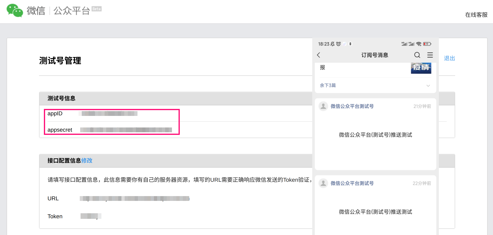

# robFoodDD
上海疫情买菜难，该脚本可帮助自动化抢购，接口调用存在封号风险，若非实在缺菜不建议使用！

该项目为本人第一个Golang项目，主要目的为学习语法与规范，如有代码相关问题欢迎讨论指导！

另外由于时间仓促，一些容错逻辑较为粗糙，结账商品数据未完整分析，可能存在部分类型商品无法结账的情况(如有发现可提issue)，后续有时间的话可能会继续完善。

## 使用方式

1.配置 DDXQSESSID

电脑浏览器从此地址登录后即可从 Cookie 取得 DDXQSESSID

> https://activity.m.ddxq.mobi/#/coupon?code=VERxg&h5_source=caocao&btnType=jumpApp&path=https://u.100.me/m/maicai&random=4

然后配置环境变量

```shell
export DDXQSESSID=xxxxxxx
```

2.配置推送密钥

a.使用 Bark 推送

下载 Bark 后从 App 界面获取 ID 配置到环境变量

```shell
export BARKID=xxxxxxx
```


b.使用微信公众号测试号推送

访问 https://mp.weixin.qq.com/debug/cgi-bin/sandbox?t=sandbox/login 微信扫一扫开通并关注测试号

将获取到 App ID 和 App Secret 配置到环境变量

```shell
export WECHATAPPID=xxxxxxx
export WECHATAPPSECRET=xxxxxxx
```



开始运行后按命令行提示操作即可。

## 声明
本项目仅供学习交流，严禁用作商业行为，特别禁止黄牛加价代抢等！

因违法违规等不当使用导致的后果与本人无关，如有任何问题可联系本人删除！
