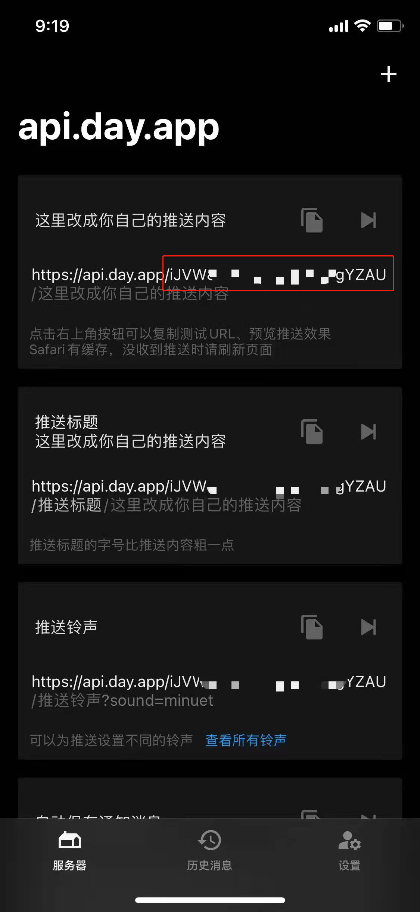

# robFoodDD
上海疫情买菜难，该脚本可帮助自动化抢购，接口调用存在封号风险，若非实在缺菜不建议使用！

该项目为本人第一个Golang项目，主要目的为学习语法与规范，如有代码相关问题欢迎讨论指导！

另外由于时间仓促，一些容错逻辑较为粗糙，结账商品数据未完整分析，可能存在部分类型商品无法结账的情况(如有发现可提issue)，后续有时间的话可能会继续完善。

目前邮费数据默认为免邮，若已用过首单优惠请保持订单总额超过免邮门槛，否则无法正常下单！

## 使用方式
在配置文件中添加以下信息：
```
# 多账号情况下，请保证账号在不同设备的登录状态
users:
  - userName: xxx # 用户名
    cookie: DDXQSESSID=XXXXXXX # cookie 获取方式参考下文
    barkId: xxx # barkid 获取方式参考下文
    ddmcUid: xxx # ddmc-uid 获取方式参考下文
    addressNum: 0 # 此处建议选择自己常用地址<添加新地址后，请更新此地址索引号，默认最近新加地址>
    payMethodNum: 2 # 支付方式序号[1：支付宝 2：微信<default>)]
    settlementMode: 1 # 结算模式序号 [1：结算所有有效商品（不包括换购）<default> 2：结算所有勾选商品（包括换购)]
```
其中第一个参数为叮咚登录cookie，需要抓包获取，形式为```"DDXQSESSID=xxxxxxxxxxx""```<br>
ddmcUid与抓取cookie方法一致，在header中搜索 ddmc-uid复制其value 填入配置文件之中。
ddmc-uid 经检查历史抓包记录，发现是今下午新增验证方式，获取接口为```https://pilot.ddxq.mobi/v1/ios/invite?uid=xxx&type=1&version=1159&isbeta=0```
暂时未发现其生成规律，直接使用暂未出现异常。

第二个参数为通知用的bark id，下载bark后从app界面获取



```bigquery
# crontab mode

58 5 * * * cd /opt/project/robfood && ./robfooddd >> /tmp/robfooddd.log 2>&1
27 8 * * * cd /opt/project/robfood && ./robfooddd >> /tmp/robfooddd.log 2>&1


```

## 声明
本项目仅供学习交流，严禁用作商业行为，特别禁止黄牛加价代抢等！

因违法违规等不当使用导致的后果与本人无关，如有任何问题可联系本人删除！